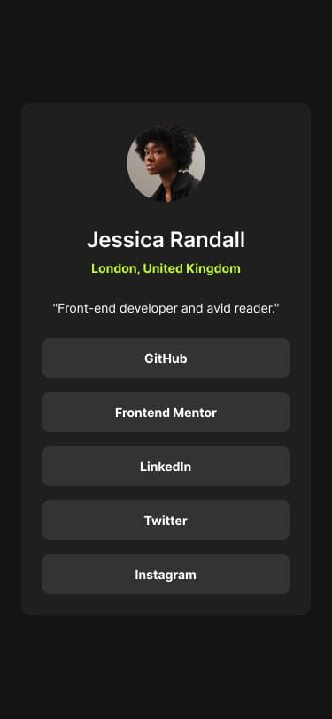

 # Social links profile

## Table of contents

- [Overview](#overview)
  - [Screenshot](#screenshot)
  - [Links](#links)
- [My process](#my-process)
  - [Built with](#built-with)
  - [What I learned](#what-i-learned)
- [Author](#author)
- [Acknowledgments](#acknowledgments)

## Overview

### Screenshot

#### Desktop view:


#### Modile view:


### Links

- Source Code: [view on GitHub](https://github.com/Sibi-Ram/Social-links-profile)
- Live Site URL: [Social Links profile website](https://sibi-ram.github.io/Social-links-profile/)

## My process

### Built with


- 
- 
- Flexbox
- Mobile-first workflow

### What I learned

In order to change the hand (pointer) cursor colour I used the custom cursor image(svg or png)
```css
button:hover {
  cursor: url('black-hand-cursor.png'), pointer;
}
```

To center items within a CSS Grid, I used the 
```css 
place-items: center;
``` 
property on the grid container. This property is a shorthand for
```css
align-items: center;
justify-items: center;
```
which will center items both vertically and horizontally within their grid cells. 


***used min-width for media query ensuring mobile first layout approach and used the relative units like em***


**Key Learning:**

_To change the hand (pointer) cursor colour I used the custom cursor image(svg or png)_

_For vertical centering with flexbox, the container must have a defined height._


## Author

- Twitter - [SR-theDev](https://www.twitter.com/SRtheDev)
- Frontend Mentor - [Sibi-Ram](https://www.frontendmentor.io/profile/Sibi-Ram)


## Acknowledgments

This is my solution to the [Social links profile challenge on Frontend Mentor](https://www.frontendmentor.io/challenges/social-links-profile-UG32l9m6dQ).

